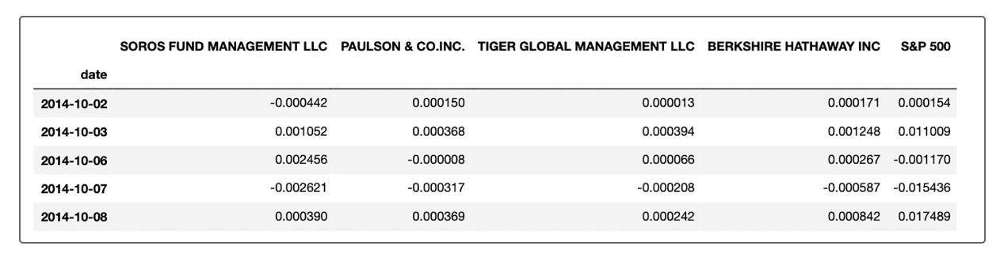

# Project Title - Risk Return Analysis 
The goal of this project was to perform a risk return analysis on four investment funds known as Whales. These were used as investment options which were included in our clients' portfolios for determining the fund with the most investment potential.  

# Project Description
In the evaluation and determination of the fund with the most investment potential for our clients, we focused on five key components: performance, volatility, risk, risk-return profile and portfolio diversification.  
  
  
# Install and Run JupyterLab or Jupyter Notebook 

Install JupyterLab or Jupyter Notebook using PIP from the Python Package Index and run from the command console: https://jupyter.org/install

# How to Use the Project

### 1.) Launce the file, risk_return_analysis.ipynb 

### 2.) Import the required libraries and dependencies 
<ul>   
           <li>import pandas as pd</li>
           <li>from pathlib import Path</li>
           <li>import numpy as np</li>
           <li>%matplotlib inline</li>
</ul> 

### 3.) Use the read_csv function and the Path module to read the whale_navs.csv file into a Pandas DataFrame. Be sure to create a DateTimeIndex. Review the first five rows of the DataFrame by using the head function. 

### 4.) Use the Pandas pct_change function together with dropna to create the daily returns DataFrame. Base this DataFrame on the NAV prices of the four portfolios and on the closing price of the S&P 500 Index. Review the first five rows of the daily returns DataFrame. The following image shows how your daily returns DataFrame should appear: 

### 5.) Run the quantative analysis

<b>a. Analyze the Performance</b>
<ol>
<li>Used the default Pandas plot function to visualize the daily return data of the four fund portfolios and the S&P 500.</li>
<li>Used the Pandas cumprod function to calculate the cumulative returns for the four fund portfolios and the S&P 500. Reviewed the last five rows of the cumulative returns DataFrame by using the Pandas tail function.</li>
<li>Used the default Pandas plot to visualize the cumulative return values for the four funds and the S&P 500 over time.  Included the title parameter, and adjusted the figure size if necessary.</li>
</ol>
   
<b>b. Analyze the Voltatility</b>
<ol>
<li>Used the Pandas plot function and the kind="box" parameter to visualize the daily return data for each of the four portfolios and for the S&P 500 in a box plot.</li>
<li>Used the Pandas drop function to create a new DataFrame that contains the data for just the four fund portfolios by dropping the S&P 500 column. Visualized the daily return data for just the four fund portfolios by using another box plot.  Included the title parameter, and adjusted the figure size if necessary.</li>
</ol>            
    
<b>c. Analyze the Risk</b> 
<ol>
Evaluated the risk profile of each portfolio by using the standard deviation and the beta. To do so, I completed the following steps:
<li>Used the Pandas std function to calculate the standard deviation for each of the four portfolios and for the S&P 500. Reviewed the standard deviation calculations, sorted from smallest to largest.</li>
<li>Calculated the annualized standard deviation for each of the four portfolios and for the S&P 500. To do that, multiplied the standard deviation by the square root of the number of trading days. Used 252 for that number.</li>
<li>Used the daily returns DataFrame and a 21-day rolling window to plot the rolling standard deviations of the four fund portfolios and of the S&P 500 index. Included the title parameter, and adjusted the figure size if necessary.</li>
<li>Used the daily returns DataFrame and a 21-day rolling window to plot the rolling standard deviations of only the four fund portfolios. Included the title parameter, and adjusted the figure size if necessary.</li>
</ol>

<b>d. Analyze the Risk-Return Profile</b> 
<ol>
To determine the overall risk of an asset or portfolio, quantitative analysts and investment managers consider not only its risk metrics but also its risk-return profile. After all, if I have two portfolios that each offer a 10% return but one has less risk, you’d probably invest in the smaller-risk portfolio. For this reason, I needed to consider the Sharpe ratios for each portfolio. To do so, I completed the following steps:
<li>Used the daily return DataFrame to calculate the annualized average return data for the four fund portfolios and for the S&P 500. Used 252 for the number of trading days. Reviewed the annualized average returns, sorted from lowest to highest.</li>
<li>Calculated the Sharpe ratios for the four fund portfolios and for the S&P 500. To do that, divided the annualized average return by the annualized standard deviation for each. Review the resulting Sharpe ratios, sorted from lowest to highest.</li>
<li>Visualized the Sharpe ratios for the four funds and for the S&P 500 in a bar chart.</li>
</ol>   
    
<b>e. Analyze the Portfoio Diversification</b> 
<ol>
<li>Our analysis is nearing completion. Now, we need to evaluate how the portfolios react relative to the broader market. Based on our analysis so far, chose two portfolios that we most likely to recommend as investment options. To start our analysis, we completed the following steps:</li>
<li>Used the Pandas var function to calculate the variance of the S&P 500 by using a 60-day rolling window. Visualized the last five rows of the variance of the S&P 500.</li>
Next, for each of the two portfolios that we chose, we completed the following steps.
<li>Used the 60-day rolling window, the daily return data, and the S&P 500 returns, calculated the covariance. Reviewed the last five rows of the covariance of the portfolio.</li>
<li>Calculated the beta of the portfolio. To do that, we divided the covariance of the portfolio by the variance of the S&P 500.</li>
<li>Used the Pandas mean function to calculate the average value of the 60-day rolling beta of the portfolio.</li>
<li>Plotted the 60-day rolling beta. Included the title parameter, and adjusted the figure size if necessary.</li>
</ol>

# Credits
I would like to give full credit to the products, software and web development teams for their contribution.

# License
No License

